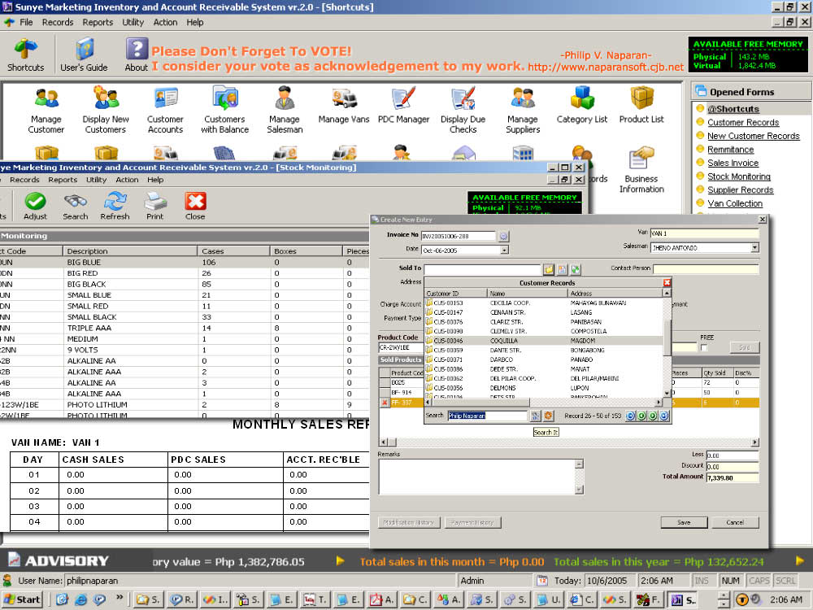



## A        Complete Inventory and Account Receivable System \(UPDATED\)

### Description

This is an inventory and account receivable system project which I made some of my client here in Philippines.The program uses ADO and have lot of functionalities. The program can be able to run using keyboard,track user updates and etc. If you download this program you will learn the fallowing:(1) Know how to use ADO in real world business software. (2) Know how to handle millions of records using paging techniques.(3) How to use listview in database programming. (4) How to use flexgrid in creading a Master Detail form. (5) How to use crystal report (6) How to how to design a good looking software. (7) You will learn how to use custom define procedures and functions to optimize your codes. (8) You will learn the used of string and file manipulation in real world. (9) The used of API in real world database programming.There is a lot more to learn from this code... so download it and share your comment on what you have learn. Please don't forget to vote! I CONSIDER YOUR VOTE AS ONE WAY ON HOW YOU WILL ACKNOWLEDGE MY WORK!! have a nice day and GOD Bless :-) -Philip
 
### More Info
 

             |
---                |---
**Submitted On**   |2005-10-12 20:49:18
**By**             |[Philip  V\. Naparan :\-\)](https://github.com/Planet-Source-Code/PSCIndex/blob/master/ByAuthor/philip-v-naparan.md)
**Level**          |Intermediate
**User Rating**    |4.8 (2698 globes from 562 users)
**Compatibility**  |VB 3\.0, VB 4\.0 \(16\-bit\), VB 4\.0 \(32\-bit\), VB 5\.0, VB 6\.0, VB Script, ASP \(Active Server Pages\) , VBA MS Access, VBA MS Excel
**Category**       |[Complete Applications](https://github.com/Planet-Source-Code/PSCIndex/blob/master/ByCategory/complete-applications__1-27.md)
**World**          |[Visual Basic](https://github.com/Planet-Source-Code/PSCIndex/blob/master/ByWorld/visual-basic.md)
**Archive File**   |[AAA\_Comple19396310122005\.zip](https://github.com/Planet-Source-Code/philip-v-naparan-a-complete-inventory-and-account-receivable-system-updated__1-62781/archive/master.zip)

